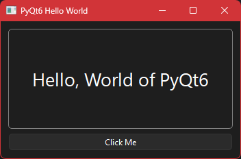

# hello-pyqt6
Hello World Application

 

## Dependences
```
pip install PyQt6
```

## Running
```
python3 hello-pyqt6.py
```
## Tested
- Windows 11
- AlmaLinux 10 KDE Plasma 6
- Mint 22

## License
[License](LICENSE) MIT

## Author
**dastamu** - [Profil GitHub](https://github.com/dastamu)
